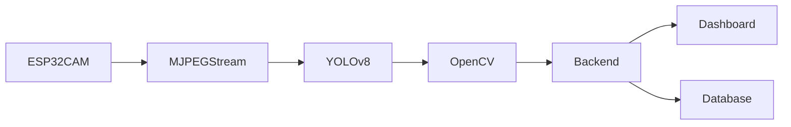

# Spectra – System Overview

> **Document:** 01 – System Overview
> **Version:** 2.0
> **Last Updated:** 2026-03-09
> **Status:** Active
> **Authors:** Spectra Development Team

---

# Table of Contents

1. Introduction
2. Problem Statement
3. Industrial Motivation
4. Vision-Based Inspection Systems
5. Objectives of Spectra
6. Key Features
7. Core Capabilities
8. System Components
9. Inspection Workflow
10. End-to-End Data Flow
11. Example Inspection Scenario
12. Supported Use Cases
13. Industrial Applications
14. Benefits Over Traditional Inspection
15. Limitations and Constraints
16. Safety Considerations
17. Future Expansion Possibilities
18. Conclusion

---

# 1. Introduction

**Spectra** is an intelligent **vision-based inspection platform** designed to automate the detection and dimensional analysis of cylindrical industrial components such as rods and pipes.

Modern manufacturing environments require **rapid and precise inspection systems** to maintain production quality and efficiency. Traditional manual inspection methods are often:

- slow
- inconsistent
- prone to human error
- difficult to scale

Spectra addresses these challenges by combining:

- embedded vision hardware
- deep learning object detection
- classical computer vision measurement algorithms
- web-based monitoring dashboards

The platform enables **real-time automated inspection**, allowing engineers and operators to monitor production processes and analyze measurement data continuously.

### Spectra Technology Stack

| Layer        | Technology            | Purpose                          |
| ------------ | --------------------- | -------------------------------- |
| Hardware     | ESP32-CAM (OV2640)    | Image capture and WiFi streaming |
| Streaming    | MJPEG HTTP Stream     | Camera video transmission        |
| AI Detection | YOLOv8 (Local Models) | Real-time object detection       |
| Measurement  | OpenCV (Python)       | Geometric measurement            |
| Backend      | Node.js + Express     | API and data processing          |
| Frontend     | React 19 + TypeScript | Monitoring dashboard             |
| Database     | Firebase (Cloud Firestore) | Persistent inspection data       |

Unlike cloud-based inspection systems, Spectra performs **AI inference locally**, eliminating network dependency and reducing latency.

---

# 2. Problem Statement

Manufacturing industries frequently produce cylindrical components such as:

- steel rods
- hollow pipes
- aluminum tubes
- structural reinforcement bars

These components must satisfy **strict dimensional tolerances**.

Traditional inspection methods rely on:

- manual caliper measurements
- visual inspection
- offline quality control

However, these approaches present several challenges.

### Human Error

Manual measurements introduce variability due to:

- operator fatigue
- inconsistent techniques
- subjective judgment

### Limited Scalability

Manual inspection cannot keep up with high-speed production lines.

### Delayed Feedback

Quality defects may only be detected **after production**, increasing material waste.

### Lack of Real-Time Monitoring

Most traditional inspection systems lack **continuous monitoring capabilities**.

Spectra solves these problems through **automated AI-driven inspection**.

---

# 3. Industrial Motivation

Modern industries increasingly adopt **Industry 4.0 technologies** to improve production efficiency.

Vision-based inspection systems enable:

- automated quality control
- defect detection
- dimensional verification
- production analytics

Industries benefiting from automated inspection include:

- steel manufacturing
- pipe extrusion
- construction materials
- automotive manufacturing
- logistics and warehousing

Spectra provides a **low-cost and scalable inspection platform** suitable for these environments.

---

# 4. Vision-Based Inspection Systems

Vision systems analyze images captured by cameras using computer algorithms.

Typical inspection systems include:

1. Image Acquisition
2. Image Processing
3. Object Detection
4. Measurement Analysis
5. Data Visualization

Traditional systems rely on classical image processing techniques such as:

- edge detection
- threshold segmentation
- template matching

While fast, these methods struggle under:

- varying lighting conditions
- cluttered backgrounds
- object orientation changes

Spectra uses a **hybrid approach**:

| Technique            | Role                    |
| -------------------- | ----------------------- |
| YOLOv8 Deep Learning | Robust object detection |
| OpenCV Geometry      | Precise measurement     |

This combination improves both **robustness and accuracy**.

---

# 5. Objectives of Spectra

The primary goal of Spectra is to develop a **real-time automated inspection system** for rods and pipes.

### Key Objectives

**Automated Detection**

Detect cylindrical objects automatically.

**Dimensional Measurement**

Compute object measurements including:

- diameter
- length

**Real-Time Monitoring**

Display inspection results through a live dashboard.

**Industrial Scalability**

Support multiple inspection stations.

**Cost Efficiency**

Use low-cost hardware such as ESP32-CAM.

**Local AI Processing**

Run detection models locally to ensure reliability.

---

# 6. Key Features

Spectra includes several powerful features.

### Real-Time AI Detection

YOLOv8 models detect rods and pipes in live video streams.

### Dual-Model Detection

Two detection models are used:

- pipe circle detection
- pipe line detection

### OpenCV Measurement Engine

OpenCV algorithms compute geometric measurements.

### Live Monitoring Dashboard

Operators can view inspection results in real time.

### Data Export

Inspection results can be exported as:

- CSV
- Excel
- PDF

### Remote Monitoring

Users can access the dashboard via web browsers.

---

# 7. Core Capabilities

Spectra provides several integrated capabilities.

### Object Detection

YOLOv8 models detect rods and pipes.

### Object Counting

Detected objects are automatically counted.

### Dimensional Measurement

Measurements include:

- pipe diameter
- rod length

### Visualization

Detection overlays are displayed on live video streams.

### Analytics

Historical inspection data can be analyzed through dashboards.

---

# 8. System Components

Spectra consists of several interconnected components.

### Hardware Layer

Includes:

- ESP32-CAM camera modules
- servo motor camera mounts
- battery power supply

### Streaming Layer

Video frames are streamed using **MJPEG HTTP streams**.

### AI Inference Layer

YOLOv8 models perform real-time object detection locally.

### Measurement Engine

OpenCV algorithms compute dimensions.

### Web Application

A React dashboard displays inspection results.

---

# 9. Inspection Workflow

The inspection process follows several stages.

1. image capture
2. frame streaming
3. AI detection
4. measurement computation
5. dashboard visualization

### Workflow Diagram

---

# 10. End-to-End Data Flow

---

# 11. Example Inspection Scenario

Consider a warehouse containing stacked steel pipes.

1. The camera captures the pipe bundle.
2. Frames are streamed to the local AI engine.
3. YOLOv8 models detect pipe openings.
4. OpenCV algorithms compute pipe diameter.
5. Results appear on the monitoring dashboard.

The operator can instantly verify product quality.

---

# 12. Supported Use Cases

Spectra supports various industrial applications.

Examples include:

- pipe inspection
- rod counting
- dimensional verification
- automated inventory tracking

---

# 13. Industrial Applications

Spectra can be deployed in several industries.

### Steel Manufacturing

Verification of rod dimensions.

### Pipe Production

Monitoring extrusion quality.

### Construction Materials

Inspection of reinforcement bars.

### Warehousing

Automated counting of pipe bundles.

---

# 14. Benefits Over Traditional Inspection

| Feature          | Manual Inspection  | Spectra           |
| ---------------- | ------------------ | ----------------- |
| Inspection Speed | Slow               | Real-time         |
| Accuracy         | Operator dependent | Algorithmic       |
| Consistency      | Variable           | Highly consistent |
| Data Recording   | Manual             | Automatic         |
| Scalability      | Limited            | Easily scalable   |

---

# 15. Limitations and Constraints

Despite its advantages, Spectra has some limitations.

### Lighting Conditions

Poor lighting may reduce detection accuracy.

### Camera Calibration

Measurement accuracy depends on proper calibration.

### Camera Resolution

Low-resolution cameras limit measurement precision.

### Mitigation Strategies

| Limitation        | Solution                      |
| ----------------- | ----------------------------- |
| Poor lighting     | Use LED illumination          |
| Calibration drift | Periodic calibration          |
| Low resolution    | Use higher resolution cameras |

---

# 16. Safety Considerations

When deploying Spectra in industrial environments:

- ensure secure camera mounting
- avoid interfering with machinery
- follow electrical safety guidelines

---

# 17. Future Expansion Possibilities

Potential improvements include:

### Defect Detection

Detect cracks or surface damage.

### Multi-Camera Systems

Monitor larger production areas.

### Edge AI Hardware

Run detection on dedicated edge devices.

### Industrial Integration

Integrate with PLC and MES systems.

---

# 18. Conclusion

Spectra represents a modern approach to industrial inspection by integrating:

- embedded vision hardware
- local AI detection models
- classical computer vision measurement
- web-based monitoring tools

This hybrid system enables **accurate, real-time automated inspection** suitable for industrial environments.
