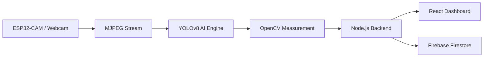
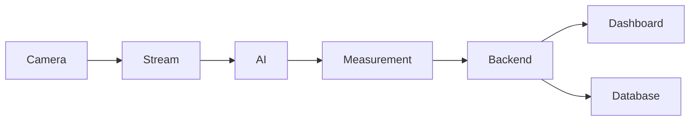

# Spectra System Architecture

> **Document:** 02 – System Architecture
> **Version:** 2.0
> **Last Updated:** 2026-03-09
> **Status:** Active
> **Authors:** Spectra Development Team
> **Prerequisites:** [01 – System Overview](01-system-overview.md)

---

# Table of Contents

1. Architecture Overview
2. High-Level System Architecture
3. Hardware Layer
4. Edge Device Layer
5. Streaming Layer
6. AI Inference Layer
7. Measurement Processing Layer
8. Backend Application Layer
9. Web Application Layer
10. Data Storage Layer
11. Communication Protocols
12. Data Flow Diagrams
13. Fault Tolerance
14. System Monitoring
15. Health Check Mechanisms
16. Performance Optimization
17. Scalability Design
18. Security Architecture
19. Industrial Integration Architecture
20. Conclusion

---

# 1. Architecture Overview

The **Spectra platform** is designed as a **modular real-time inspection system** capable of detecting and measuring cylindrical industrial components such as rods and pipes.

The architecture integrates:

- embedded vision hardware
- real-time camera streaming
- local AI inference
- computer vision measurement algorithms
- web-based monitoring dashboards

Unlike many cloud-based inspection systems, Spectra performs **AI inference locally**, ensuring low latency and reliable operation in industrial environments.

### Major System Layers

1. Hardware Layer
2. Edge Device Layer
3. Streaming Layer
4. AI Inference Layer
5. Measurement Processing Layer
6. Backend Application Layer
7. Web Application Layer
8. Data Storage Layer

Each layer performs specialized tasks while interacting with other layers through defined interfaces.

---

# 2. High-Level System Architecture

The Spectra platform follows a **pipeline architecture**, where camera frames move through several processing stages.



This modular architecture allows each component to be upgraded independently.

### Advantages

- modular design
- easier debugging
- scalable deployments
- independent component upgrades

---

# 3. Hardware Layer

The **hardware layer** captures images from the inspection environment.

### Hardware Components

- ESP32-CAM module
- OV2640 camera sensor
- servo motor pan-tilt holder
- lithium battery pack
- optional LCD display

### Camera System

Key parameters:

- image resolution
- camera stability
- lighting conditions
- inspection distance

The ESP32-CAM captures frames and transmits them via WiFi.

---

# 4. Edge Device Layer

The **edge device layer** is responsible for image acquisition and streaming.

Typical edge devices include:

- ESP32-CAM
- USB webcam
- industrial cameras

### Edge Device Responsibilities

- frame capture
- frame encoding
- camera control
- network transmission

### Device Comparison

| Device            | Cost     | Resolution | Best Use            |
| ----------------- | -------- | ---------- | ------------------- |
| ESP32-CAM         | Very low | 2MP        | Low-cost inspection |
| USB Webcam        | Low      | HD         | Development         |
| Industrial Camera | High     | 4K         | Production systems  |

---

# 5. Streaming Layer

The streaming layer transmits frames from the camera to the AI processing system.

Spectra uses **MJPEG streaming from ESP32-CAM**.

### Stream Format

```
http://ESP32_IP:81/stream
```

### Streaming Workflow

1. camera captures frame
2. frame encoded as JPEG
3. MJPEG stream transmitted via HTTP
4. Python AI engine receives frames

Advantages:

- simple integration
- low implementation complexity
- compatible with OpenCV

---

# 6. AI Inference Layer

The **AI inference layer** performs object detection.

Spectra uses **locally stored YOLOv8 models**.

### Detection Models

| Model                 | File                 |
| --------------------- | -------------------- |
| Pipe Circle Detection | pipe_circle_model.pt |
| Pipe Line Detection   | pipe_line_model.pt   |

### AI Engine Technologies

- Ultralytics YOLOv8
- Python
- OpenCV

### Detection Workflow

1. receive frame
2. preprocess frame
3. run YOLO detection
4. generate bounding boxes

Example detection output:

```json
{
  "class": "pipe_circle",
  "confidence": 0.94,
  "bbox": [120, 80, 40, 40]
}
```

Local inference provides:

- faster detection
- no internet dependency
- reliable industrial operation

---

# 7. Measurement Processing Layer

This layer computes **precise dimensional measurements** using OpenCV.

### Measurement Algorithms

- contour detection
- circle detection
- geometric analysis
- pixel-to-millimeter calibration

### Measurement Workflow

1. receive bounding box
2. refine object contour
3. compute geometry
4. convert pixels to mm

---

# 8. Backend Application Layer

The backend manages:

- AI result processing
- API endpoints
- session management
- database communication

### Backend Technologies

- Node.js
- Express.js
- REST APIs

Example API endpoint:

```
POST /api/detection
```

---

# 9. Web Application Layer

The web application provides a real-time monitoring interface.

### Frontend Technologies

- React 19
- TypeScript
- Tailwind CSS
- Vite

### Dashboard Features

- live camera feed
- AI detection visualization
- measurement results
- inspection history

---

# 10. Data Storage Layer

The system uses **Firebase** for persistent storage.

### Stored Data

- inspection sessions
- measurement results
- detection logs
- system configuration

### Storage Architecture

| Storage Type | Purpose             |
| ------------ | ------------------- |
| Firebase     | inspection database |
| IndexedDB    | browser caching     |

---

# 11. Communication Protocols

Spectra relies on multiple protocols.

| Protocol | Use                            |
| -------- | ------------------------------ |
| HTTP     | MJPEG video streaming          |
| REST API | frontend-backend communication |
| HTTPS    | secure API communication       |

---

# 12. Data Flow Diagram



---

# 13. Fault Tolerance

Industrial systems must handle failures gracefully.

### Recovery Mechanisms

| Failure              | Recovery                  |
| -------------------- | ------------------------- |
| Camera disconnect    | reconnect automatically   |
| Network interruption | retry connection          |
| AI failure           | restart detection service |
| Backend crash        | automatic restart         |

---

# 14. System Monitoring

Monitoring metrics include:

- camera connectivity
- frame processing rate
- AI inference latency
- server CPU usage

Monitoring data appears in the **system health dashboard**.

---

# 15. Health Check Mechanisms

Backend health endpoint:

```
GET /api/health
```

Example response:

```json
{
  "status": "ok",
  "uptime": "72 hours"
}
```

---

# 16. Performance Optimization

Performance improvements include:

- frame skipping
- image resizing
- efficient model variants

Typical latency:

| Stage          | Latency |
| -------------- | ------- |
| Frame capture  | <10ms   |
| YOLO inference | 20-60ms |
| Measurement    | <30ms   |
| Total          | <120ms  |

---

# 17. Scalability Design

Spectra supports multi-camera deployments.

### Scaling Strategies

- multiple inspection stations
- distributed AI engines
- centralized database

---

# 18. Security Architecture

Security features include:

- HTTPS encryption
- API authentication
- environment variable protection

Sensitive keys are stored in:

```
.env
```

---

# 19. Industrial Integration Architecture

Spectra can integrate with:

- PLC systems
- ERP platforms
- MES systems

Inspection data can be exported through REST APIs.

---

# 20. Conclusion

The Spectra system architecture combines:

- embedded vision hardware
- local YOLOv8 AI detection
- OpenCV measurement algorithms
- modern web monitoring tools

This architecture enables **accurate, low-latency industrial inspection without cloud dependency**, making it suitable for real-world manufacturing environments.
