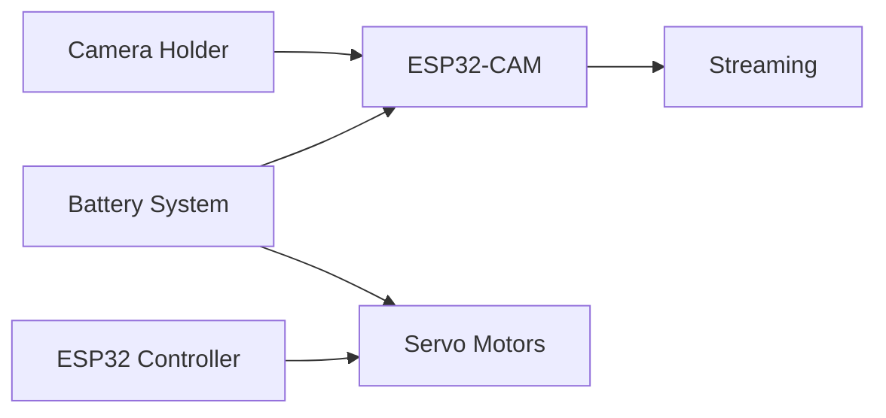

# Hardware and Image Acquisition

> **Document:** 03 – Hardware and Image Acquisition
> **Version:** 1.1
> **Last Updated:** 2026-03-08
> **Status:** Active
> **Authors:** Spectra Development Team
> **Prerequisites:** [01 – System Overview](01-system-overview.md), [02 – System Architecture](02-system-architecture.md)

---

## Table of Contents

- [1. Hardware Overview](#1-hardware-overview)
- [2. ESP32-CAM Module](#2-esp32-cam-module)
- [3. Camera Specifications](#3-camera-specifications)
- [4. Servo Motor Control System](#4-servo-motor-control-system)
- [5. Robotic Holder Design](#5-robotic-holder-design)
- [6. Pan-Tilt Mechanism](#6-pan-tilt-mechanism)
- [7. Power System Design](#7-power-system-design)
- [8. Battery Configuration](#8-battery-configuration)
- [9. Breadboard Wiring](#9-breadboard-wiring)
- [10. Optional Components](#10-optional-components)
- [11. LCD Integration](#11-lcd-integration)
- [12. Buzzer Integration](#12-buzzer-integration)
- [13. Camera Mounting Guidelines](#13-camera-mounting-guidelines)
- [14. ESP32 Firmware Setup](#14-esp32-firmware-setup)
- [15. WiFi Streaming Configuration](#15-wifi-streaming-configuration)
- [16. Camera Calibration](#16-camera-calibration)
- [17. Field Deployment Setup](#17-field-deployment-setup)
- [18. Maintenance Guidelines](#18-maintenance-guidelines)
- [19. Hardware Troubleshooting](#19-hardware-troubleshooting)
- [Conclusion](#conclusion)
- [Document Cross-References](#document-cross-references)

---

# 1. Hardware Overview

The Spectra hardware subsystem is responsible for capturing images of rods or pipes from the inspection environment.

The hardware architecture includes the following components:

| Component              | Purpose                  |
| ---------------------- | ------------------------ |
| ESP32-CAM              | Image capture device     |
| Servo Motors           | Camera movement control  |
| Robotic Holder         | Camera mounting platform |
| Breadboard             | Electrical prototyping   |
| Lithium Batteries      | Power supply             |
| LCD Display (optional) | Status display           |
| Buzzer (optional)      | Alert notifications      |

The hardware system is designed to support **real-time inspection and flexible deployment scenarios**.

### Bill of Materials (BOM)

| #   | Component                    | Quantity | Estimated Cost    | Supplier Options           |
| --- | ---------------------------- | -------- | ----------------- | -------------------------- |
| 1   | ESP32-CAM Module             | 1        | $5–$8             | AliExpress, Amazon, Mouser |
| 2   | SG90 Servo Motor             | 2        | $2–$4 each        | Amazon, Adafruit           |
| 3   | Mini Breadboard              | 1        | $1–$2             | Any electronics supplier   |
| 4   | 3.7V Lithium Battery (18650) | 2        | $3–$5 each        | Battery specialty stores   |
| 5   | Battery Holder (2x18650)     | 1        | $1–$2             | Amazon, AliExpress         |
| 6   | USB-to-Serial Adapter (FTDI) | 1        | $3–$5             | Amazon, SparkFun           |
| 7   | Jumper Wires (M-M, M-F)      | 1 pack   | $2–$3             | Any electronics supplier   |
| 8   | 3D Printed Camera Holder     | 1        | $5–$10 (material) | DIY / 3D printing service  |
| 9   | LCD Display 16×2 (optional)  | 1        | $3–$5             | Amazon, Adafruit           |
| 10  | Piezo Buzzer (optional)      | 1        | $0.50–$1          | Any electronics supplier   |

**Total Estimated Cost: $25–$45** (base configuration)

> **Tip:** The low hardware cost makes Spectra ideal for deploying multiple inspection stations across a facility without significant capital investment.

### Hardware Architecture Diagram



---

# 2. ESP32-CAM Module

The **ESP32-CAM** is a compact, low-cost microcontroller board with a built-in camera module.

It integrates:

- ESP32 microcontroller
- OV2640 camera sensor
- WiFi connectivity
- microSD card slot

### Key Features

- dual-core processor
- WiFi 802.11 b/g/n
- low power consumption
- programmable via Arduino IDE

### Typical Applications

- surveillance cameras
- IoT monitoring
- robotics
- machine vision

In Spectra, the ESP32-CAM is used for:

- capturing inspection images
- transmitting video streams
- controlling camera positioning

---

# 3. Camera Specifications

The camera sensor used in the ESP32-CAM module is the **OV2640 image sensor**.

### Camera Specifications

| Feature       | Value                     |
| ------------- | ------------------------- |
| Sensor        | OV2640                    |
| Resolution    | up to 1600×1200           |
| Frame Rate    | up to 30 FPS              |
| Field of View | ~65°                      |
| Interface     | Parallel camera interface |

### Supported Resolutions

- UXGA (1600×1200)
- SVGA (800×600)
- VGA (640×480)
- QVGA (320×240)

For inspection tasks, **640×480 resolution** provides a good balance between:

- detection accuracy
- inference speed
- network bandwidth

### Resolution vs. Performance Trade-offs

| Resolution       | Frame Rate | Bandwidth           | Detection Quality | Recommended Use         |
| ---------------- | ---------- | ------------------- | ----------------- | ----------------------- |
| QVGA (320×240)   | 30 FPS     | Low (~150 KB/s)     | Basic detection   | Rapid prototyping       |
| VGA (640×480)    | 25 FPS     | Medium (~500 KB/s)  | Good accuracy     | **Standard inspection** |
| SVGA (800×600)   | 15 FPS     | High (~800 KB/s)    | High accuracy     | Detailed measurement    |
| UXGA (1600×1200) | 5 FPS      | Very High (~2 MB/s) | Maximum detail    | Offline analysis        |

> **Note:** Higher resolutions improve measurement precision but reduce frame rate. For real-time inspection, VGA (640×480) is recommended. See **[05 – Measurement and Vision Processing](05-measurement-and-vision-processing.md)** for how resolution affects measurement accuracy.

---

# 4. Servo Motor Control System

Servo motors enable **dynamic camera positioning**.

The Spectra system uses **two servo motors**:

| Servo   | Function       |
| ------- | -------------- |
| Servo 1 | Vertical tilt  |
| Servo 2 | Horizontal pan |

### Servo Control Signals

Servo motors operate using **PWM signals**.

Typical parameters:

- frequency: 50 Hz
- pulse width: 1 ms – 2 ms
- rotation range: 0° – 180°

### Servo Wiring

Servo motors have three wires:

| Wire          | Function |
| ------------- | -------- |
| Red           | Power    |
| Brown/Black   | Ground   |
| Yellow/Orange | Signal   |

### ESP32-CAM Pin Connections

| Component      | ESP32 Pin | Signal Type    | Notes               |
| -------------- | --------- | -------------- | ------------------- |
| Servo 1 (Pan)  | GPIO 14   | PWM Output     | Horizontal rotation |
| Servo 2 (Tilt) | GPIO 15   | PWM Output     | Vertical rotation   |
| Buzzer         | GPIO 12   | Digital Output | Optional alert      |
| LCD SDA        | GPIO 13   | I2C Data       | Optional display    |
| LCD SCL        | GPIO 2    | I2C Clock      | Optional display    |
| LED Flash      | GPIO 4    | Digital Output | Built-in flash LED  |

> **Warning:** GPIO 0 is used for boot mode selection. Do not connect peripherals to GPIO 0 as it may prevent firmware upload. GPIO 4 controls the built-in flash LED and may interfere with image capture if set HIGH.

---

# 5. Robotic Holder Design

The robotic holder provides a **mechanical mounting structure** for the ESP32-CAM.

The holder enables:

- stable camera positioning
- servo-driven rotation
- adjustable viewing angles

### Holder Structure

Typical components:

- base plate
- vertical mount
- camera bracket
- servo connectors

3D printed holders are commonly used.

---

# 6. Pan-Tilt Mechanism

The pan-tilt mechanism allows the camera to **scan the inspection area dynamically**.

### Pan Movement

Horizontal rotation up to **180°**.

Used for:

- scanning pipe stacks
- covering large inspection areas

### Tilt Movement

Vertical movement allows adjustment of camera angle.

Useful for:

- close-range inspection
- multi-level pipe stacks

---

# 7. Power System Design

The power system supplies energy to the ESP32-CAM and servo motors.

### Power Requirements

| Component    | Voltage |
| ------------ | ------- |
| ESP32-CAM    | 5V      |
| Servo Motors | 5–6V    |

### Power Options

- USB power
- battery packs
- DC power adapters

In field deployments, **battery power** is often used.

### Power Consumption Estimates

| Component             | Active Current | Standby Current | Voltage |
| --------------------- | -------------- | --------------- | ------- |
| ESP32-CAM (streaming) | ~160 mA        | ~20 mA          | 5V      |
| ESP32-CAM (WiFi TX)   | ~240 mA peak   | —               | 5V      |
| Servo Motor (moving)  | ~200 mA each   | ~10 mA          | 5V      |
| LCD Display           | ~25 mA         | ~1 mA           | 5V      |
| Buzzer                | ~30 mA         | 0 mA            | 3.3V    |
| **Total (typical)**   | **~630 mA**    | **~50 mA**      | —       |

> **Tip:** With two 3.7V/2600mAh 18650 batteries, expect approximately **3–4 hours** of continuous operation. For permanent installations, use a regulated 5V DC power supply instead of batteries.

---

# 8. Battery Configuration

The system uses **two 3.7V lithium batteries**.

These batteries are connected to provide sufficient voltage.

### Battery Components

- lithium-ion cells
- battery holder
- voltage regulator (optional)

### Battery Safety

Important precautions:

- avoid short circuits
- use proper battery holders
- monitor battery temperature

---

# 9. Breadboard Wiring

A **mini breadboard** is used for prototyping the circuit connections.

### Breadboard Purpose

- easy component connections
- quick testing
- modular wiring

Typical connections include:

- servo signal lines
- power distribution
- ground connections

---

# 10. Optional Components

Spectra supports optional hardware components to enhance system functionality.

Optional modules include:

- LCD display
- buzzer
- additional sensors

These components can provide additional feedback to operators.

---

# 11. LCD Integration

An **LCD display** can be used to show system status information.

Example display information:

- WiFi connection status
- system ready state
- camera streaming status

### Example LCD Output

```
Spectra System
Camera: Connected
Status: Streaming
```

---

# 12. Buzzer Integration

A buzzer can be used to provide **audible alerts**.

Possible use cases:

- system startup
- inspection completion
- error detection

### Buzzer Connection

The buzzer is connected to a digital output pin on the ESP32.

---

# 13. Camera Mounting Guidelines

Proper camera mounting is critical for accurate inspection.

### Mounting Considerations

- stable mounting surface
- appropriate camera height
- optimal viewing angle

### Recommended Position

Camera should be positioned:

- perpendicular to pipe axis
- with minimal vibration
- with consistent lighting

---

# 14. ESP32 Firmware Setup

The ESP32-CAM is programmed using **Arduino IDE**.

### Installation Steps

1. Install Arduino IDE
2. Install ESP32 board support
3. Connect ESP32 via USB-to-serial adapter
4. Upload firmware

### Example Initialization Code

```cpp
#include "esp_camera.h"

// Camera pin configuration for ESP32-CAM (AI-Thinker module)
#define PWDN_GPIO_NUM     32
#define RESET_GPIO_NUM    -1
#define XCLK_GPIO_NUM      0
#define SIOD_GPIO_NUM     26
#define SIOC_GPIO_NUM     27
#define Y9_GPIO_NUM       35
#define Y8_GPIO_NUM       34
#define Y7_GPIO_NUM       39
#define Y6_GPIO_NUM       36
#define Y5_GPIO_NUM       21
#define Y4_GPIO_NUM       19
#define Y3_GPIO_NUM       18
#define Y2_GPIO_NUM        5
#define VSYNC_GPIO_NUM    25
#define HREF_GPIO_NUM     23
#define PCLK_GPIO_NUM     22

void setup() {
  Serial.begin(115200);

  camera_config_t config;
  config.pin_pwdn = PWDN_GPIO_NUM;
  config.pin_reset = RESET_GPIO_NUM;
  config.xclk_freq_hz = 20000000;
  config.pixel_format = PIXFORMAT_JPEG;
  config.frame_size = FRAMESIZE_VGA;  // 640x480
  config.jpeg_quality = 12;
  config.fb_count = 1;

  esp_err_t err = esp_camera_init(&config);
  if (err != ESP_OK) {
    Serial.printf("Camera init failed: 0x%x\n", err);
    return;
  }
  Serial.println("Camera initialized successfully");
}
```

> **Warning:** Ensure the camera pin configuration matches your specific ESP32-CAM board variant. The AI-Thinker module uses the pin mapping shown above, but other variants may differ.

---

# 15. WiFi Streaming Configuration

The ESP32-CAM connects to a WiFi network to transmit video streams.

### Network Setup

The firmware contains WiFi credentials:

```cpp
const char* ssid = "YourNetwork";
const char* password = "YourPassword";
```

### Streaming URL

The camera provides a streaming endpoint:

```
http://<camera-ip>/stream
```

---

# 16. Camera Calibration

Calibration ensures accurate measurement results.

### Calibration Methods

Common calibration techniques include:

- reference object calibration
- checkerboard calibration
- known dimension markers

Calibration determines the **pixel-to-real-world conversion factor**.

---

# 17. Field Deployment Setup

For industrial deployment, the system should be installed carefully.

### Deployment Steps

1. mount camera
2. connect power
3. connect to WiFi
4. verify video stream
5. start inspection dashboard

### Environmental Considerations

- temperature
- lighting conditions
- dust protection

---

# 18. Maintenance Guidelines

Regular maintenance ensures reliable operation.

### Recommended Maintenance

- clean camera lens
- inspect wiring
- verify power connections
- update firmware

---

# 19. Hardware Troubleshooting

### Camera Not Detected

Possible causes:

- loose wiring
- incorrect firmware
- power supply issues

### WiFi Connection Failure

Possible causes:

- incorrect credentials
- weak signal
- network restrictions

**Solutions:**

- Verify SSID and password in firmware
- Move camera closer to WiFi access point
- Check router firewall settings
- Use `WiFi.RSSI()` to check signal strength (should be > -70 dBm)

### Servo Not Moving

Possible causes:

- incorrect wiring
- insufficient power
- incorrect PWM configuration

**Solutions:**

- Verify servo wire connections against pin table in Section 4
- Ensure power supply can deliver > 500mA
- Check PWM frequency is set to 50Hz
- Test servo independently with a simple sweep sketch

> **Tip:** When troubleshooting, use the Arduino Serial Monitor to check for error messages. Add diagnostic `Serial.println()` statements to identify which initialization step is failing.

---

# Conclusion

The hardware subsystem forms the **foundation of the Spectra inspection platform**.

By combining:

- ESP32-CAM vision modules
- servo-driven camera positioning
- reliable power systems
- flexible mounting designs

the system provides a **cost-effective and scalable image acquisition solution** suitable for industrial inspection environments.

### Hardware Setup Checklist

- [ ] ESP32-CAM module functional and firmware uploaded
- [ ] Camera captures clear images at target resolution
- [ ] WiFi connection stable with RSSI > -70 dBm
- [ ] Servo motors respond to PWM signals correctly
- [ ] Pan range covers inspection area (0°–180°)
- [ ] Tilt range provides optimal viewing angle
- [ ] Power supply delivers sufficient current (> 630mA)
- [ ] Camera mounted securely with minimal vibration
- [ ] Streaming endpoint accessible from backend server
- [ ] Calibration reference measurement verified

---

# Document Cross-References

| Document                                                      | Relevance to Hardware                    |
| ------------------------------------------------------------- | ---------------------------------------- |
| [01 – System Overview](01-system-overview.md)                 | System context and objectives            |
| [02 – Architecture](02-system-architecture.md)                | Hardware layer in system architecture    |
| [04 – AI Detection](04-ai-detection-system.md)                | How captured frames are processed        |
| [05 – Measurement](05-measurement-and-vision-processing.md)   | Calibration requirements for measurement |
| [08 – Deployment](08-deployment-operations-and-user-guide.md) | Field deployment and maintenance         |
