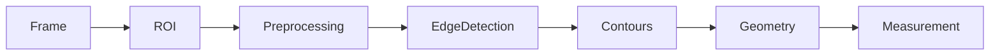
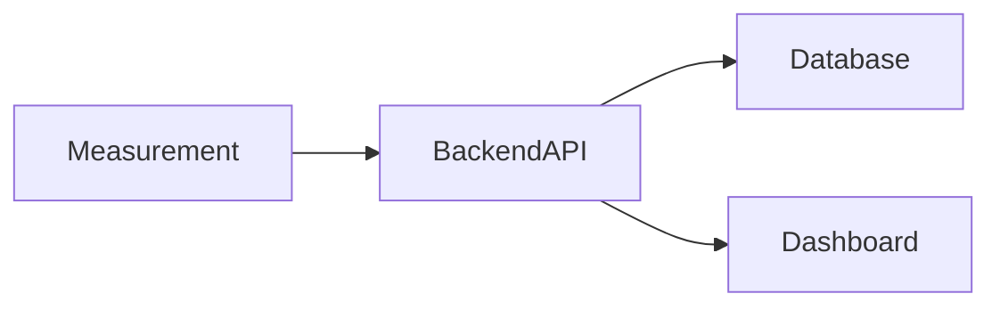

# Measurement and Vision Processing

> **Document:** 05 – Measurement and Vision Processing
> **Version:** 2.0
> **Last Updated:** 2026-03-09
> **Status:** Active
> **Authors:** Spectra Development Team
> **Prerequisites:** [04 – AI Detection System](04-ai-detection-system.md)

---

# Table of Contents

1. Overview of Dimensional Measurement
2. Classical Computer Vision Overview
3. OpenCV Processing Pipeline
4. Data Extraction from YOLOv8 Models
5. ROI Extraction
6. Circle Detection Processing
7. Line Detection Processing
8. Contour Analysis
9. Edge Detection
10. Geometric Feature Extraction
11. Pixel-to-Real Calibration
12. Calibration Techniques
13. Diameter Measurement Algorithm
14. Length Measurement Algorithm
15. Measurement Error Handling
16. Accuracy Optimization
17. Measurement Visualization
18. JSON Output Format
19. Integration with Backend API
20. Performance Considerations

---

# 1. Overview of Dimensional Measurement

The **Measurement and Vision Processing module** computes the physical dimensions of rods and pipes detected by the AI detection system.

While YOLOv8 detection models identify objects and provide bounding boxes, they do not provide exact dimensions.

To compute accurate measurements such as:

- pipe diameter
- rod length
- object orientation

Spectra uses **classical computer vision algorithms implemented with OpenCV**.

This hybrid architecture combines:

- **deep learning detection**
- **geometry-based measurement**

This ensures high reliability in industrial inspection tasks.

---

# 2. Classical Computer Vision Overview

Deep learning models are excellent for object detection, but classical computer vision algorithms are better suited for **precise geometric analysis**.

Spectra uses OpenCV-based algorithms for measurement tasks.

### Key Algorithms Used

- Canny Edge Detection
- Contour Detection
- Hough Circle Transform
- Hough Line Transform
- Geometric Feature Extraction

### Algorithm Comparison

| Algorithm            | Purpose              | Spectra Usage          |
| -------------------- | -------------------- | ---------------------- |
| Canny Edge Detection | Boundary detection   | Pre-processing         |
| HoughCircles         | Detect pipe openings | Diameter estimation    |
| HoughLinesP          | Detect rod segments  | Length estimation      |
| findContours         | Shape extraction     | Measurement refinement |
| minAreaRect          | Bounding rectangle   | Length estimation      |

---

# 3. OpenCV Processing Pipeline

The OpenCV measurement pipeline consists of multiple processing stages.

### Processing Stages

1. frame acquisition
2. ROI extraction
3. image preprocessing
4. edge detection
5. contour extraction
6. geometric measurement

### Processing Pipeline



Each stage progressively refines image data.

---

# 4. Data Extraction from YOLOv8 Models

The AI detection system uses **YOLOv8 models running locally**.

Detection results include:

- object class
- bounding box coordinates
- confidence score

### Example YOLOv8 Output

```json
{
  "class": "pipe_circle",
  "confidence": 0.93,
  "bbox": [210, 140, 40, 40]
}
```

These bounding boxes define the **region of interest (ROI)** used for measurement.

---

# 5. ROI Extraction

The region containing the detected object is extracted for detailed analysis.

### Example Python Code

```python
for result in results:
    x1, y1, x2, y2 = result.boxes.xyxy[0]
    roi = frame[int(y1):int(y2), int(x1):int(x2)]
```

ROI extraction significantly reduces computational load.

---

# 6. Circle Detection Processing

Circular pipe openings are analyzed using **circle detection algorithms**.

### Method 1 – Hough Circle Transform

```python
circles = cv2.HoughCircles(
    gray,
    cv2.HOUGH_GRADIENT,
    dp=1,
    minDist=50
)
```

### Method 2 – Contour-Based Circle Fitting

```python
(x,y),radius = cv2.minEnclosingCircle(contour)
```

The radius is used to compute pipe diameter.

---

# 7. Line Detection Processing

Rod bodies appear as elongated shapes.

These are detected using line detection algorithms.

### Hough Line Detection

```python
lines = cv2.HoughLinesP(
    edges,
    rho=1,
    theta=np.pi/180,
    threshold=100
)
```

Detected lines provide length information.

---

# 8. Contour Analysis

Contours represent the boundaries of objects.

### Contour Extraction

```python
contours, hierarchy = cv2.findContours(
    binary,
    cv2.RETR_TREE,
    cv2.CHAIN_APPROX_SIMPLE
)
```

Contours provide accurate shape representation.

---

# 9. Edge Detection

Edge detection highlights object boundaries.

Spectra uses **Canny Edge Detection**.

```python
edges = cv2.Canny(gray,50,150)
```

Edge maps are used for contour detection.

---

# 10. Geometric Feature Extraction

Once contours are detected, geometric features can be extracted.

### Example

```python
(x,y),radius = cv2.minEnclosingCircle(contour)
```

Important geometric features:

- centroid
- radius
- orientation
- bounding rectangle

---

# 11. Pixel-to-Real Calibration

Computer vision measurements are initially calculated in pixels.

To convert to millimeters:

```
Real Length = Pixel Length × Calibration Factor
```

The calibration factor is determined using a reference object.

---

# 12. Calibration Techniques

### Reference Object Calibration

Place a known object in the camera view.

Example:

- calibration ruler
- known diameter pipe

### Calibration Procedure

1. capture reference object image
2. measure object in pixels
3. compute calibration factor

```
factor = known_mm / measured_pixels
```

---

# 13. Diameter Measurement Algorithm

Pipe diameter is estimated using detected circles.

### Measurement Steps

1. detect circular contour
2. compute radius
3. convert radius to millimeters

### Formula

```
Diameter = 2 × Radius × Calibration Factor
```

---

# 14. Length Measurement Algorithm

Rod length is estimated using detected line segments.

### Steps

1. detect line segment
2. compute pixel length
3. convert to millimeters

### Formula

```
Length = Pixel Length × Calibration Factor
```

---

# 15. Measurement Error Handling

Measurement errors may occur due to:

- lighting variations
- camera vibration
- detection inaccuracies

### Error Mitigation

- frame averaging
- smoothing filters
- outlier rejection

---

# 16. Accuracy Optimization

Several techniques improve measurement accuracy.

### High Resolution Imaging

Higher resolution increases measurement precision.

### Camera Stabilization

Reduces contour detection errors.

### Controlled Lighting

Improves edge detection reliability.

---

# 17. Measurement Visualization

Measurement results are overlaid on video frames.

### Overlay Elements

- bounding boxes
- dimension labels
- measurement lines

Example overlay:

```
Diameter: 24.5 mm
Length: 102.3 mm
```

---

# 18. JSON Output Format

Measurement results are structured as JSON objects.

### Example Output

```json
{
  "object_id": 1,
  "diameter_mm": 24.6,
  "length_mm": 102.4,
  "confidence": 0.92
}
```

This format simplifies integration with the backend.

---

# 19. Integration with Backend API

Measurement results are transmitted to the backend server.

### Data Flow



The backend then stores results in the database and updates the dashboard.

---

# 20. Performance Considerations

Real-time inspection requires efficient processing.

### Performance Factors

- image resolution
- object count
- CPU performance

### Optimization Techniques

- ROI processing
- frame skipping
- lightweight YOLO models

Typical performance:

| Stage              | Latency |
| ------------------ | ------- |
| YOLO detection     | 20–60ms |
| OpenCV measurement | 20–30ms |
| Backend processing | <20ms   |

Total processing latency remains under **120ms**, enabling real-time inspection.

---

# Conclusion

The Measurement and Vision Processing module transforms **YOLOv8 detection outputs into precise physical measurements**.

By combining:

- deep learning detection
- classical OpenCV geometry
- calibration techniques

Spectra achieves **accurate real-time dimensional inspection suitable for industrial environments**.

---

# Document Cross-References

| Document                                                      | Relevance                                 |
| ------------------------------------------------------------- | ----------------------------------------- |
| [03 – Hardware](03-hardware-and-acquisition.md)               | Camera calibration and hardware setup     |
| [04 – AI Detection](04-ai-detection-system.md)                | Detection models producing bounding boxes |
| [06 – Web Application](06-web-application-platform.md)        | Dashboard visualization                   |
| [07 – Development](07-development-and-api.md)                 | Measurement API endpoints                 |
| [08 – Deployment](08-deployment-operations-and-user-guide.md) | Production calibration and operation      |
