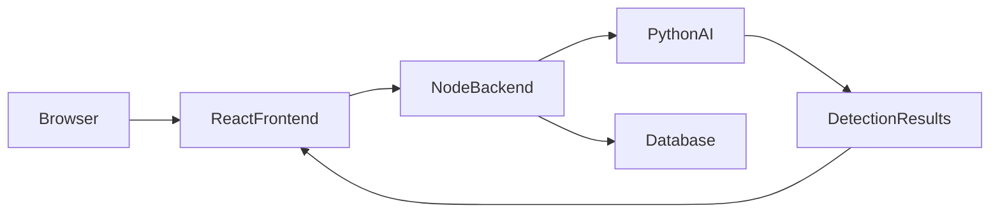
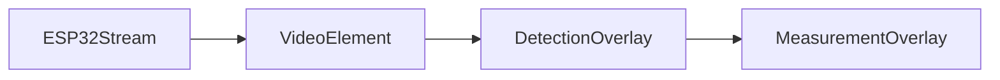
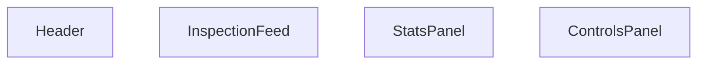
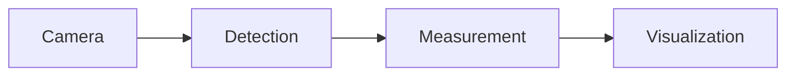

# Spectra Web Application Platform

> **Document:** 06 – Web Application Platform
> **Version:** 2.0
> **Last Updated:** 2026-03-09
> **Status:** Active
> **Authors:** Spectra Development Team
> **Prerequisites:**
> [01 – System Overview](01-system-overview.md)
> [02 – System Architecture](02-system-architecture.md)

---

# Table of Contents

1. Platform Overview
2. Full Stack Architecture
3. Frontend Technology Stack
4. React Application Structure
5. State Management
6. UI Component Architecture
7. Camera Interface
8. Detection Visualization
9. Measurement Display
10. Dashboard Layout
11. Public Pages
12. Authentication Pages
13. Dashboard Pages
14. Inspection Interface
15. Analytics Dashboard
16. Inventory Management
17. Alert System
18. Settings Configuration
19. Admin Panel
20. UI Performance Optimization

---

# 1. Platform Overview

The **Spectra Web Application Platform** provides the interactive interface used by operators and engineers to monitor the automated rod and pipe inspection system.

The platform integrates several subsystems including:

- live camera streaming
- AI detection visualization
- measurement results
- inspection analytics
- inventory tracking
- system configuration

The platform is implemented as a **modern full-stack web application** using **React, Node.js, and Firebase services**.

Unlike cloud-AI systems, Spectra connects to a **local AI inference engine** running YOLOv8 models.

---

# 2. Full Stack Architecture

The Spectra web platform follows a **three-tier architecture**.

### Architecture Layers

1. Frontend Interface
2. Backend API Server
3. Local AI Processing Service

### Architecture Diagram



### Component Roles

**Frontend**

- dashboard UI
- video display
- detection visualization

**Backend**

- API endpoints
- session management
- database communication

**AI Service**

- YOLOv8 detection
- OpenCV measurement processing

**Database**

- Firebase Cloud Firestore
- inspection data storage

---

# 3. Frontend Technology Stack

The Spectra frontend uses modern web technologies.

| Technology    | Purpose               |
| ------------- | --------------------- |
| React 19      | UI framework          |
| TypeScript    | Type-safe development |
| Vite          | Build tool            |
| Tailwind CSS  | Styling               |
| Framer Motion | UI animations         |
| Recharts      | Data visualization    |

### Advantages

- fast UI rendering
- reusable components
- responsive layouts
- scalable architecture

---

# 4. React Application Structure

The frontend is organized into modular directories.

```
src/
  components/
  pages/
  hooks/
  services/
  store/
  utils/
  types/
```

### Application Entry Files

```
main.tsx
App.tsx
```

These initialize the application and routing system.

### Routing

React Router manages navigation between pages.

---

# 5. State Management

Application state stores dynamic inspection data.

Examples include:

- detected objects
- measurement values
- camera connection status
- user authentication

Spectra uses **Zustand** for lightweight state management.

### Example Store

```typescript
const useInspectionStore = create((set) => ({
  objects: [],
  setObjects: (data) => set({ objects: data }),
}));
```

---

# 6. UI Component Architecture

The interface is built using reusable components.

### Component Categories

| Category               | Purpose                 |
| ---------------------- | ----------------------- |
| Camera Components      | Display camera stream   |
| Detection Components   | Bounding box overlays   |
| Measurement Components | Dimension labels        |
| Chart Components       | Analytics graphs        |
| UI Components          | Buttons, modals, panels |

### Folder Structure

```
components/
  camera/
  detection/
  measurement/
  charts/
  ui/
```

---

# 7. Camera Interface

The camera interface displays the **live inspection feed**.

Spectra retrieves video frames using **ESP32-CAM MJPEG streaming**.

### Stream Example

```
http://ESP32_IP:81/stream
```

### Camera Workflow



---

# 8. Detection Visualization

Detection overlays display YOLOv8 predictions on the camera feed.

### Overlay Elements

- bounding boxes
- class labels
- confidence scores

Example overlay:

```
Pipe Circle
Confidence: 0.92
```

The overlay updates in real time.

---

# 9. Measurement Display

Measurement results are displayed on the video frame.

### Displayed Values

- pipe diameter
- rod length
- object count

Example overlay:

```
Diameter: 24.5 mm
Length: 102.3 mm
```

---

# 10. Dashboard Layout

The dashboard organizes the inspection interface.

### Main Sections

| Section          | Function               |
| ---------------- | ---------------------- |
| Inspection Feed  | Live camera view       |
| Statistics Panel | Measurement statistics |
| Alert Panel      | System notifications   |
| Control Panel    | Camera controls        |

### Layout Structure



---

# 11. Public Pages

Public pages provide system information.

Example routes:

```
/
 /demo
 /docs
 /pricing
```

These pages require no authentication.

---

# 12. Authentication Pages

Authentication allows secure access.

Supported actions:

- login
- registration
- password reset

Authentication is managed using **Firebase Authentication**.

Example routes:

```
/login
/register
/reset-password
```

---

# 13. Dashboard Pages

The dashboard includes several functional pages.

| Page       | Purpose            |
| ---------- | ------------------ |
| Dashboard  | Overview           |
| Inspection | Live inspection    |
| Analytics  | Data visualization |
| History    | Inspection records |
| Inventory  | Object inventory   |
| Alerts     | Notifications      |

---

# 14. Inspection Interface

The inspection page is the **central operational view**.

### Features

- live camera feed
- detection overlays
- measurement values
- camera controls

### Workflow



---

# 15. Analytics Dashboard

The analytics dashboard visualizes inspection history.

### Visualizations

- detection frequency
- measurement distributions
- inspection trends

Charts are created using **Recharts**.

---

# 16. Inventory Management

The inventory module stores detected object data.

### Stored Fields

- object type
- diameter
- length
- inspection timestamp
- location

### Inventory Actions

- add records
- update records
- search inspection history

---

# 17. Alert System

The alert system notifies operators about system issues.

### Alert Types

- camera disconnection
- AI processing errors
- measurement anomalies
- system warnings

### Notification Methods

- dashboard alerts
- email alerts
- sound notifications

---

# 18. Settings Configuration

The settings panel allows system configuration.

### Configurable Parameters

- camera stream URL
- AI detection thresholds
- calibration factor
- alert preferences

---

# 19. Admin Panel

The admin panel provides system management tools.

### Admin Features

- user management
- inspection logs
- system monitoring
- configuration controls

Only authorized administrators can access this panel.

---

# 20. UI Performance Optimization

Real-time systems require efficient UI rendering.

### Optimization Techniques

- React memoization
- lazy loading
- efficient state updates
- optimized component rendering

### Performance Targets

| Metric                 | Target    |
| ---------------------- | --------- |
| First Contentful Paint | <1.5s     |
| Time to Interactive    | <3s       |
| Video Frame Rate       | 25–30 FPS |
| Overlay Latency        | <50ms     |

---

# Conclusion

The Spectra Web Application Platform serves as the **interactive control center** of the inspection system.

By integrating:

- real-time camera streaming
- YOLOv8 detection visualization
- OpenCV measurement results
- analytics dashboards

the platform enables operators to **monitor inspection processes and analyze measurement data efficiently through a modern browser interface**.

---

# Document Cross-References

| Document                                                      | Relevance              |
| ------------------------------------------------------------- | ---------------------- |
| [01 – System Overview](01-system-overview.md)                 | System capabilities    |
| [02 – System Architecture](02-system-architecture.md)         | Platform architecture  |
| [04 – AI Detection](04-ai-detection-system.md)                | Detection models       |
| [05 – Measurement](05-measurement-and-vision-processing.md)   | Measurement algorithms |
| [07 – Development](07-development-and-api.md)                 | Backend API            |
| [08 – Deployment](08-deployment-operations-and-user-guide.md) | System deployment      |
