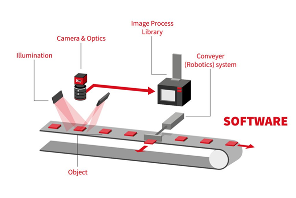

# 1 INTRODUCTION

## 1.1 ORIGIN OF THE PROJECT

Manufacturing industries frequently produce cylindrical components such as steel rods, hollow pipes, aluminum tubes, and structural reinforcement bars. These components must satisfy strict dimensional tolerances to ensure quality, structural integrity, and safety in downstream applications. The origin of this project, "Spectra," stems from the pressing industrial need to automate the detection and dimensional analysis of such cylindrical industrial components. Modern manufacturing environments require rapid and precise inspection systems to maintain production quality and efficiency. Traditional manual inspection methods fall short of these modern manufacturing requirements, prompting the development of an intelligent vision-based inspection platform capable of real-time monitoring and measurement.

## 1.2 COMMON PRACTICES

In contemporary industrial settings, traditional inspection practices primarily rely on manual measurements and visual inspections. Quality control personnel utilize physical metrology tools such as manual calipers, micrometers, and measuring tapes to verify dimensional tolerances like diameter, length, and wall thickness. Visual inspection is also routinely conducted by human operators to identify glaring surface defects or structural irregularities. These practices are typically performed offline, meaning that manufactured batches are removed from the active production line and inspected in a dedicated quality control environment. This isolation leads to discontinuous monitoring, severely limiting the ability to catch sequential defects as they happen.

_Figure 1.2: Traditional vs. Automated Inspection Workflows — A side-by-side workflow diagram comparing manual offline measurement processes with real-time automated AI inspection on a continuous manufacturing line._

## 1.3 EXISTING TECHNOLOGIES

Existing technologies in the domain of automated inspection include conventional machine vision systems. These systems utilize classical image processing algorithms—such as edge detection (e.g., Canny or Sobel operators), threshold segmentation, and template matching—to automate geometric measurements. While these classical computer vision technologies offer improved speed over manual inspection, they demonstrate significant vulnerabilities. Variations in ambient lighting conditions, cluttered manufacturing backgrounds, and fluctuations in object orientation severely degrade their accuracy and robust operation. Additionally, advanced cloud-based AI solutions have emerged as a modern alternative, but they introduce network latency dependencies, security concerns, and increased operational costs, which are detrimental to high-speed, real-time control at the factory edge.

## 1.4 PROBLEM STATEMENT

Traditional manual inspection methods and deterministic vision systems present several critical shortcomings when deployed in modern, high-speed manufacturing environments. The specific problems this project addresses can be categorized into the following key issues:

1. **Inconsistency and Human Error**: Manual measurements introduce significant variability due to operator fatigue, varying baseline techniques, and subjective human judgment, which ultimately leads to unreliable quality control.
2. **Delayed Defect Identification**: Because existing inspections are frequently performed offline, there is a delayed feedback loop. Dimensional deviations may only be noticed after a large batch of defective components has already been manufactured, directly increasing material waste and financial losses.
3. **Environmental Susceptibility**: Conventional machine vision solutions rely on rigid edge-detection algorithms that are highly vulnerable to changing factory illumination, oil shadows, and cluttered mechanical backgrounds, leading to halted operations or false alarms.
4. **Lack of Real-Time Analytics**: Traditional setups and isolated metrology tools lack continuous, scalable monitoring capabilities, preventing operations managers from deriving actionable, data-driven production analytics and predictive maintenance insights.
5. **Cloud-Processing Latency**: While advanced cloud AI exists, streaming video to external servers introduces unpredictable network latency, security bandwidth limitations, and recurring expenses that cripple the high-speed, localized response times necessary for factory-edge dynamic sorting mechanisms.

Therefore, the main problem addressed by Spectra is the critical industry need for a resilient, real-time, and scalable automated edge-inspection platform. It must accurately detect, classify, and measure cylindrical components without human intervention, maintaining high sub-millimeter accuracy regardless of continuous production scale or dynamic localized environmental conditions.
