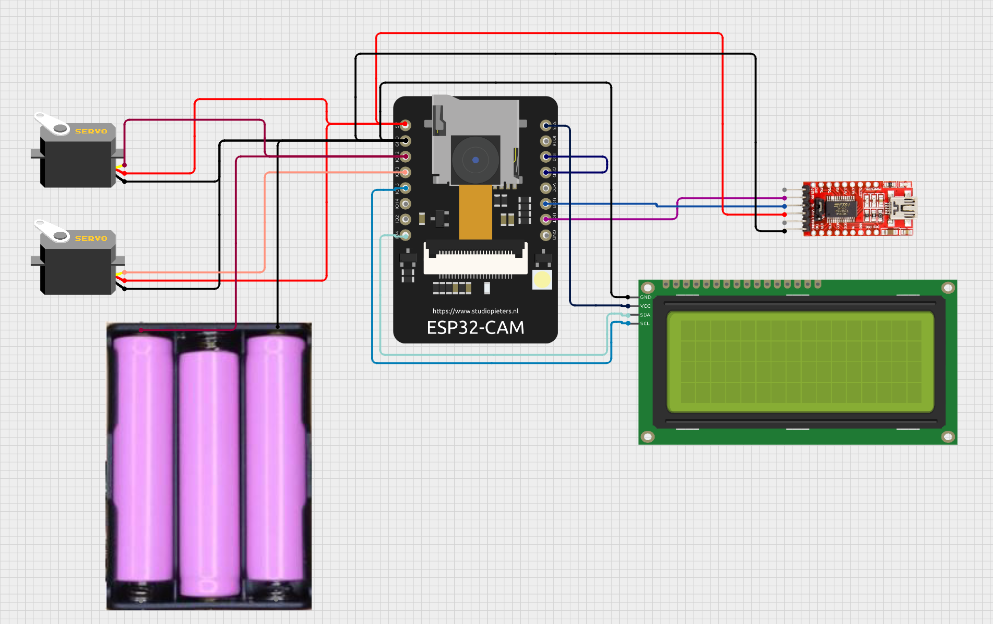

# CHAPTER 3: PROPOSED METHODOLOGY

## 3.1 OBJECTIVE

The primary objective of the proposed methodology is to design and develop a cost-effective, real-time, artificial intelligence-based inspection system for cylindrical industrial components such as rods and pipes. Key points of this methodology include:

- **Edge-Assisted Hardware Integration:** Utilizing the ESP32-CAM microcontroller for accessible, low-latency image acquisition and MJPEG streaming without expensive industrial cameras.
- **Dual-Model Vision Pipeline:** Implementing a parallelized dual YOLOv8 architecture to independently and accurately detect both lateral profiles and cross-sectional areas of objects.
- **Precision Dimensional Analysis:** Leveraging OpenCV-based metrology to convert pixel geometries into accurate physical measurements (millimeters) for automated quality assurance.
- **Centralized Full-Stack Platform:** Deploying a complete React and Node.js-based web monitoring dashboard with a Firebase Firestore to track inventory, log inspections, and dispatch critical alerts in real-time.

## 3.2 BLOCK DIAGRAM OF PROPOSED SYSTEM

The proposed system architecture is designed as a highly modular pipeline consisting of several interconnected subsystems. The block diagram illustrates the overall system flow, starting from physical image acquisition up to data visualization.

_Figure 3.1: Block Diagram of the Proposed System Architecture — A comprehensive functional flowchart._

**Description of the Block Diagram:**
The architecture operates across four primary layers:

1. **Acquisition Layer:** The ESP32-CAM Hardware Module captures environments using an OV2640 sensor. It hosts a local server to stream MJPEG video feeds over Wi-Fi, while SG90 servos provide mechanical pan/tilt tracking.
2. **Routing & Backend Layer:** A Node.js backend acts as the central orchestrator, sporting a Camera Source Selector that allows users to seamlessly toggle between the ESP32-CAM feed and a local Browser Webcam. It proxies the feeds and dispatches frame data to the inference engine.
3. **Intelligence Layer:** The local AI Inference Service (FastAPI + Python) accepts frames from the Node.js backend. It simultaneously runs YOLOv8 detection and OpenCV dimensional measurements, returning complex bounding box and metric data.
4. **Data & Presentation Layer:** The React 19 Web Dashboard renders the live feed with overlaid AI geometries. It interfaces directly with a Firebase Cloud Firestore database to persist inspection logs, inventory counts, and diagnostic alerts, ensuring data durability and rapid user access.

## 3.3 HARDWARE SIMULATION

Before the physical deployment of the embedded system, a comprehensive hardware simulation phase is planned to validate the interoperability of the electronic components.

_Figure 3.2: Circuit Diagram of Hardware System — Schematic representation of the ESP32-CAM interfacing with power regulation and servo motors._

**Hardware Simulation Details:**
The simulated circuit centers around the ESP32-CAM module functioning as the core processing and communication node. Key elements validated during simulation include:

- **Power Delivery and Regulation:** Because the ESP32-CAM's Wi-Fi radio and dual servo motors (SG90) draw significant transient currents, the simulation tests a robust power delivery network. A step-down buck converter is utilized to drop higher battery voltages (e.g., 9V or standard lithium configurations) down to a stable 5V, preventing brownout resets during peak Wi-Fi transmission.
- **Actuator Integration:** Two Pulse Width Modulation (PWM) channels from the ESP32's GPIO pins are mapped to the pan and tilt servo motors. Simulation verifies the timing and duty cycles required to sweep the camera without stalling or exceeding mechanical limits.
- **Programming Interface:** The circuit includes a CP2102/FTDI USB-to-TTL serial converter connected to the ESP32's U0R and U0T pins (with GPIO0 grounded) to simulate the firmware flashing state.

## 3.4 AI DETECTION SYSTEM

A critical component of the methodology is the embedded AI Detection System, which replaces traditional manual visual inspection. The proposed methodology leverages state-of-the-art YOLOv8 (You Only Look Once) architectures deployed via an optimized Python FastAPI backend.

To maximize accuracy and robustly handle both the ends (cross-sections) and the bodies of the cylindrical items, a **dual-model inference approach** is deployed:

1. **Pipe Circle Detection Model (pipe_circle_model.pt):** Exclusively trained to identify the circular cross-sections of pipes and rods. It highlights recognized ends with specific bounding boxes, allowing the system to isolate the faces of the objects to calculate precise internal and external diameters.
2. **Pipe Line Detection Model (pipe_line_model.pt):** Independently trained to detect the linear profiles and structural bodies of the components. This identifies the long edges of the material, used to calculate overall length and detect surface-level linear defects.

By orchestrating both models via parallel execution, the backend merges the detection sets per frame. This segmented approach prevents the compromise typical of single-model systems—where the neural network struggles to balance highly varied object aspects simultaneously—leading to significantly higher Mean Average Precision (mAP) scores during live inspection.

## 3.5 MEASUREMENT AND VISION PROCESSING SYSTEM

Subsequent to AI bounding box generation, the methodology employs a classical computer vision pipeline built upon OpenCV to extrapolate physical measurements from pixel data and conduct tolerance calculations.

The technical operations include:

- **Region of Interest (ROI) Extraction:** The system uses the distinct bounding box coordinates output by the YOLOv8 models to crop the precise segment of the image containing the subject.
- **Grayscale Conversion & Blurring:** The ROI is converted to grayscale, and a Gaussian Blur filter is applied to suppress high-frequency image noise and lighting artifacts that could falsely trigger edge detection.
- **Canny Edge & Contour Detection:** A Canny edge detector highlights the rigorous geometrical boundaries of the object. Following this, indContours is utilized to map the external closed shapes representing the physical perimeter of the pipe or rod.
- **Dimensional Estimation:** The system utilizes a mathematical camera calibration matrix to convert pixel distances (e.g., bounding box width/height or contour diameter) into real-world units (millimeters).
- **Quality Assurance Quality:** The extrapolated measurements are compared against parameterized tolerance thresholds. Products deviating from specifications (e.g., an over-diameter error of +0.5mm) are programmatically flagged as defective.

| Defect Type    | Target Dimension | Threshold (Tolerance) | System Action                | Severity |
| :------------- | :--------------- | :-------------------- | :--------------------------- | :------- |
| Over-diameter  | Cross-section    | Baseline + 0.5mm      | Flag Defective, Ignore Batch | Critical |
| Under-diameter | Cross-section    | Baseline - 0.5mm      | Flag Defective, Ignore Batch | Critical |
| Length Failure | Lateral Profile  | Baseline ± 1.0mm      | Flag Defective, Retry Scan   | Moderate |

_Table 3.1: System Tolerance Thresholds — Quality Assurance logic parameters._

## 3.6 WEB APPLICATION AND MONITORING SYSTEM

The final methodological stage involves making the extracted intelligence accessible and actionable via a centralized Web Application and Monitoring System. This heavily modularized stack is specifically engineered to handle complex asynchronous data flows from hardware to UI.
**System Architecture & Codebase Details:**

- **Frontend (React 19 & TypeScript):** The visual interface is built as a Single Page Application (SPA) utilizing Vite for rapid bundling. It features an array of custom hooks (useWebRTC, useCameraStream, useInference) to efficiently manage media streams and websocket-like polling without blocking the main browser thread. The UI maps bounding box coordinates directly onto an HTML5 <canvas> element overlaid on the video stream.
- **Backend (Node.js & Express):** A robust RESTful API acts as the middleware. It incorporates dedicated controllers for routing hardware logic (cameraController.ts, esp32Routes.ts) and offloading heavy lifting to specific services (inferenceService.ts, measurementService.ts). The Express server is secured via custom authentication middleware and dynamic environment configuration.
- **Database (Firebase Cloud Firestore):** Used for maintaining persistent state. It automates the logging of inspection events (successes vs. defects), manages a digitized inventory of processed components, and handles user authentication securely.

When a testing session concludes, an atomic finalization process updates the inspection record, commits the calculated metric dimensions, and injects alerts into the system if failure thresholds were met. This effectively digitizes the entirety of the QA pipeline.
